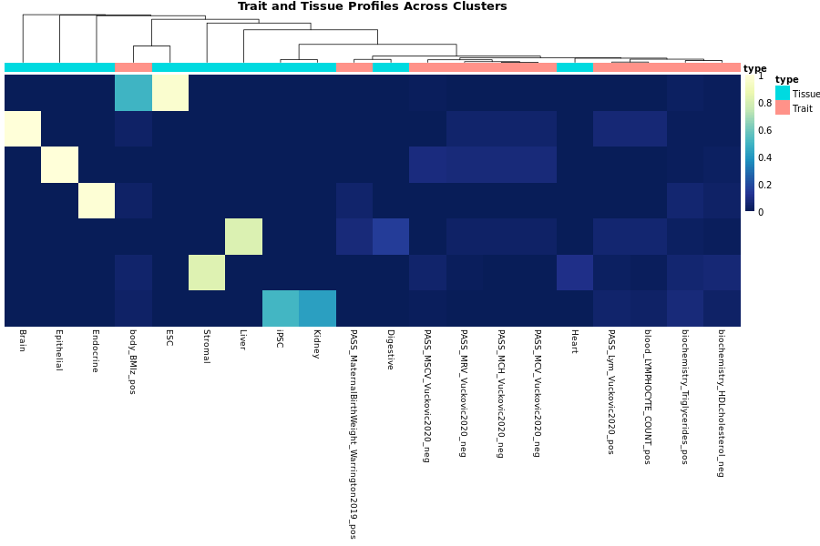

```{r, include = FALSE}
knitr::opts_chunk$set(
  collapse = TRUE,
  comment = "#>"
)
```

```{r setup}
library(jpepR)
```

# Running J-PEP: An Example Analysis on Type 2 diabetes (T2D)

This vignette demonstrates how to run the full J-PEP pipeline on a test trait (T2D), using the `jpepR` package. It includes constructing V matrices, running the matrix factorization, and visualizing trait and tissue loadings across clusters. We provide 3 preloaded datasets to use throughout this example (see below). 

## Setup and Required Libraries

```r
# Set working directory and create temporary output folder
setwd("/n/groups/price/gaspard/jpepR")
work_dir <- file.path(tempdir(), "jpep_test")
output_dir <- file.path(work_dir, "output")
dir.create(output_dir, recursive = TRUE)

# Load required libraries
library(jpepR)
library(data.table)
library(pheatmap)
library(RColorBrewer)
```

## Input Data

### Download Test Data

If you haven't already downloaded the example test files, run the following to retrieve them from the J-PEP data server:

```r
# Download test data to data-raw directory
jpepR::download_test_data(dest_dir = "data-raw")
```


### Expected Format of Input Files

The following are the expected formats for the main input files used in constructing the `V_trait` matrix:

#### `T2D_postfinemap.tsv`
This file should contain fine-mapped summary statistics for the focal trait. Expected columns:

| CHR | BP     | RSID         | A1 | A2 | BETA  | PIP   |
|-----|--------|--------------|----|----|--------|--------|
| 10  | 123456 | rs1234567890 | A  | G  | 0.0456 | 0.84   |

- **CHR**: Chromosome number (1–22)
- **BP**: Base pair position (hg19)
- **RSID**: SNP identifier (rsID)
- **A1/A2**: Effect / non-effect alleles
- **BETA**: GWAS effect size for A1
- **PIP**: Fine-mapping posterior inclusion probability (between 0 and 1)

#### `T2D_auxtraits.rda`
This R data file must contain a character vector `subset_aux` listing auxiliary trait names:

```r
subset_aux
#> [1] "PASS_HDL_UKBB" "PASS_LDL_UKBB" "PASS_BMI_UKBB" ...
```

#### `big_pleio_matrix.tsv.gz`
This file contains PIP scores for all auxiliary traits across ~1 million SNPs. It should be in wide format:

| RSID         | PASS_HDL_UKBB | PASS_LDL_UKBB | PASS_BMI_UKBB | ... |
|--------------|---------------|---------------|---------------|-----|
| rs1234567890 | 0.02          | 0.01          | 0.00          | ... |

Each cell contains the fine-mapping PIP of the corresponding SNP for a given auxiliary trait.

#### `Epimap_tracks.tsv.gz`
This file contains all genomic regions (tracks) used for computing V_tissue overlaps. Expected columns:

| CHR | START   | STOP    | track                 |
|-----|---------|---------|-----------------------|
| 1   | 10375   | 10575   | Epimap.H3K27ac.607    |
| 1   | 713175  | 713375  | Epimap.H3K27ac.596    |

- **CHR**: Chromosome number (integer, 1–22)
- **START**/**STOP**: Genomic interval (hg19)
- **track**: Unique track identifier (e.g. histone mark + sample ID)

These regions will be used to compute SNP-track overlaps based on the SNP BP position.

We will use the trait **T2D** and the following preloaded files:

- `T2D_postfinemap.tsv`: A summary statistics file containing fine-mapped results for T2D under a single causal variant assumption.
- `T2D_auxtraits.rda`: A curated subset of auxiliary traits selected based on the J-PEP publication’s auxiliary trait prioritization procedure.
- `big_pleio_matrix.tsv.gz`: A large pleiotropy matrix containing ~1 million SNPs and 164 public GWAS traits, retaining SNPs with at least one fine-mapping PIP > 0.01.

```rr
trait <- "T2D"
dir_dat <- "data-raw"
focal_loc <- list(T2D = file.path(dir_dat, "T2D_postfinemap.tsv"))
load(file.path(dir_dat, "T2D_auxtraits.rda"))  # loads 'subset_aux'
```

## Step 1: Construct V_trait Matrix

This step builds a matrix where rows are SNPs and columns are auxiliary traits. Entries are defined as the product of posterior inclusion probabilities (PIPs) for a given fine-mapped SNP (focal trait PIP >0.01) across the focal trait and a given auxiliary trait.  

```r
make_vtrait(
  focal_trait       = trait,
  aux_traits        = NULL,
  output_dir        = output_dir,
  fine_mapped_files = focal_loc,
  full_matrix_path  = file.path(dir_dat, "big_pleio_matrix.tsv.gz"),
  subset            = subset_aux
)
```

## Step 2: Construct V_tissue Matrix

This matrix reflects epigenomic overlaps between SNPs and tissue-specific annotations. Entries reflects the normalized strength of association between a fine-mapped SNP (focal trait PIP >0.01) and a tissue, computed using an Expectation-Maximization (EM) algorithm.

Although not explicitly stated in the function arguments, specifying `epi_dir = "default"` implies the use of bundled EpiMap reference data. This includes:

- `Epimap_tracks.tsv.gz`: Contains the processed epigenomic tracks.
- `Epimap_bckg_expectation.rds`: Precomputed background expectations for the EpiMap tracks.
- `Epimap_metadata.txt` and `Epimap_sampleID.txt`: Files providing metadata and sample ID mapping for the EpiMap dataset.

These files are included in the `jpepR` package and are automatically loaded when `epi_dir = "default"`.

```r
make_vtissue(
  focal_trait = trait,
  output_dir  = output_dir,
  epi_dir     = "default"
)
```

## Step 3: Intersect V_trait and V_tissue Matrices

This step ensures that only SNPs present in both the pleiotropic (V_trait) and epigenomic (V_tissue) matrices are retained. For instance, SNPs that were fine-mapped for the focal trait but not for any auxiliary trait will be excluded from the final V_trait matrix.

```r
list2env(intersect_vmatrices(trait, output_dir), envir = environment())
```

## Step 4: Run J-PEP Matrix Factorization

This step factorizes the matrices into clusters shared across traits and tissues.

```r
runs <- run_jpep_model(
  model        = "JPEP",
  V_trait,
  V_tissue,
  Tolerance    = 1e-7,
  k            = 15,
  NbrReps      = 10,
  Alpha_proj   = 10,
  w_tis        = 0.5,
  attempts     = 5
)
```

## Step 5: Process J-PEP Results

We summarize the output and extract the consensus `H_trait` and `H_tissue` matrices. Consensus is determined by running the model `NbrReps` times and selecting the solution with the highest average projection correlation among those with the most consistently identified number of clusters. In the case of ties, the solution with the smallest number of clusters is chosen.

```r
results <- concensus_run(
  model_name = "JPEP",
  runs,
  V_trait,
  V_tissue
)
```

## Step 6: Plot Trait and Tissue Profiles

We visualize the cluster loadings across the top traits and tissues using a combined heatmap.

```r
# Normalize by row
H_trait <- concensus_run$H_trait / rowSums(concensus_run$H_trait)
H_tissue <- concensus_run$H_tissue / rowSums(concensus_run$H_tissue)

# Select top contributors
top_traits_idx <- head(order(colSums(H_trait^2), decreasing = TRUE), 10)
top_tissues_idx <- head(order(colSums(H_tissue^2), decreasing = TRUE), 10)

# Combine and cluster
H_combined <- cbind(H_trait[, top_traits_idx, drop = FALSE],
                    H_tissue[, top_tissues_idx, drop = FALSE])
clust <- pheatmap(H_combined, cluster_cols = TRUE, silent = TRUE)
row_order <- clust$tree_row$order
H_combined <- H_combined[row_order, ]

# Annotate columns
trait_cols <- colnames(H_trait)[top_traits_idx]
tissue_cols <- colnames(H_tissue)[top_tissues_idx]
col_ann <- data.frame(type = c(rep("Trait", length(trait_cols)),
                               rep("Tissue", length(tissue_cols))))
rownames(col_ann) <- colnames(H_combined)

# Plot
colors <- colorRampPalette(rev(brewer.pal(9, "YlGnBu")))(100)
dir_plot <- file.path(output_dir, "plots")
dir.create(dir_plot, recursive = TRUE, showWarnings = FALSE)

png(file.path(dir_plot, "trait-tissue_map.png"), width = 900, height = 600)
pheatmap(H_combined,
         cluster_rows = FALSE,
         cluster_cols = TRUE,
         color = colors,
         annotation_col = col_ann,
         main = "Trait and Tissue Profiles Across Clusters",
         fontsize_row = 10,
         fontsize_col = 9,
         border_color = NA)
dev.off()
```

## Final Output: Heatmap of Trait and Tissue Profiles

Below is the resulting heatmap summarizing the J-PEP output:
Rows indicate identified clusters.


